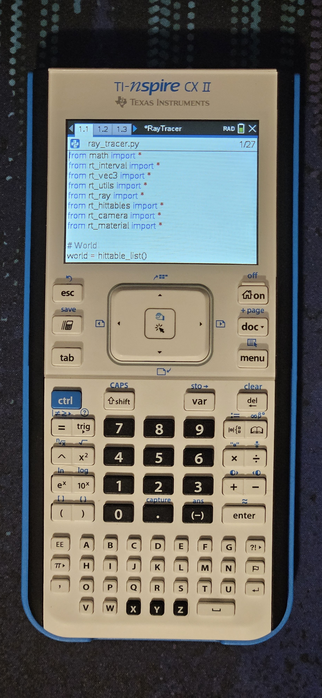

# TI-NSpire Ray Tracer

This repository includes a variety of directories related to my TI-Nspire ray tracer, which was based on the fantastic book [Ray Tracing in One Weekend](https://raytracing.github.io/) by Peter Shirley and contributors.  
The entire raytracer was made on my TI-Nspire CX II, using the built-in keyboard, Python interpreter, and libraries. My Nspire isn't jailbroken, although I would love to play with the extra functionality that brings if the community ever finds a way to jailbreak higher OS versions!  
Additionally, I wasn't able to take screenshots of my calculator screen (or easily download the `.tns` file) with any existing solutions I could find, so I debugged where the communication with `libnspire` went wrong and adjusted `libnspire-rs` so it properly communicates. This is a _super_ hacky fix, and I adjusted the `libnspire` code in multiple places, so although I would like to eventually fix the upstream issue, I just uploaded my version here for it now. It's likely because my calculator is using a random OS version that isn't particularly new but isn't one of the old well-supported ones either.

## Directory structure
- `calculator/`: The original code written for my TI-Nspire CX II calculator, in Python, dumped into a `.tns` file and exported.
- `multithreaded/`: After dumping the ray tracer, I converted it to use the Python PIL library and implemented multi-process multithreading to speed up rendering high-quality images on my computer. **This uses the exact same underlying ray tracing logic as the calculator version, but with added multithreading and a different output method.**
- `images/`: Images from all versions of the raytracer used in the samples below. Some screenshots are dumped using a modified version of the [`nspire-rs`](https://crates.io/crates/libnspire) crate, since the original crate does not properly work with my calculator. I may upload this as well after some cleanup.
- `libnspire-rs-patched`: A version of [libnspire-rs](https://github.com/lights0123/libnspire-rs/tree/main) that I adjusted to work with my calculator. I don't have proper documentation for how to build everything right now, but it probably won't work on other people's calculators anyway, so I'm not worried about it. I mostly uploaded it here for future reference.

## Features
- A full implementation of the first [Ray Tracing in One Weekend](https://raytracing.github.io/) book, including:
  - Utility class implementations
  - Lambertian, metal, and dielectric materials
  - An inheritance-based hittable system that can be expanded to objects other than spheres
  - Color correction
  - A movable camera with a parameterized field of view, resolution, and focus distance
  - Depth-of-field
- Progressive rendering: the ability to run the renderer for arbitrary lengths and slowly take more samples. Note that due to the Nspire's limited RAM, you'll receive a MemoryError if trying to render with pixels smaller than 2x2 if this is enabled.
- Multithreading (only on the `multithreaded` computer version, of course)

The implementation itself isn't super complicated, but it was a unique challenge to program a nontrivial program in such a limited environment. For example, the Nspire's Python editor only supports basic syntax highlighting (which can get tripped up by features as simple as escaped strings!), about 11 lines on the screen at once (you can technically decrease the font size, but the text becomes nearly unreadable), and a basic clipboard. I ran into RAM and stack size issues multiple times, so I needed to rewrite a few components to optimize for the limited resources. The ABCD-layout keyboard was something to get used to as well!

My TI-Nspire CX II.

## Samples

### Calculator version
An overnight render with depth-of-field:  

An older picture with a low sample count and resolution:  

The end of a render on an older version of the ray tracer, real-time:  

[old_timelapse_smaller.webm](https://github.com/Glitch752/NspireRaytracer/assets/50056537/b684b811-df8e-4d3c-94d4-8f774f6df7b0)

A timelapse of a progressive render:  

https://github.com/Glitch752/NspireRaytracer/assets/50056537/4b1a8337-65d9-4fd7-992b-83a57bdf6d8c

### Multithreaded computer version (using the raytracing code from the calculator version)
A render of the same scene as above, but with a much higher resolution and rendered in a few minutes:  

A high-resolution render of the closing picture from Ray Tracing in One Weekend:  

