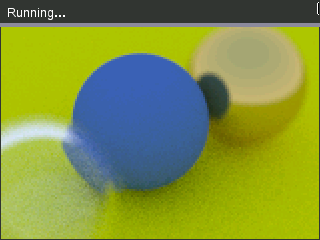

# TI-NSpire Ray Tracer

This repository includes a variety of directories related to my TI-Nspire ray tracer, which was based on the fantastic book [Ray Tracing in One Weekend](https://raytracing.github.io/) by Peter Shirley and contributors.

## Directory structure
- `calculator/`: The original code written for my TI-Nspire CX II calculator, in Python, dumped into a `.tns` file and exported.
- `multithreaded/`: After dumping the ray tracer, I converted it to use the Python PIL library and implemented multi-process multithreading to speed up rendering high-quality images on my computer. **This uses the exact same underlying ray tracing logic as the calculator version, but with added multithreading and a different output method.**
- `images/`: Images from all versions of the raytracer used in the samples below. Some screenshots are dumped using a modified version of the [`nspire-rs`](https://crates.io/crates/libnspire) crate, since the original crate does not properly work with my calculator. I may upload this as well after some cleanup.

## Samples

### Calculator version
An overnight render with depth-of-field:  

An older picture with a low sample count and resolution:  

The end of a render on an older version of the ray tracer, real-time:  

[old_timelapse_smaller.webm](https://github.com/Glitch752/NspireRaytracer/assets/50056537/b684b811-df8e-4d3c-94d4-8f774f6df7b0)

A timelapse of a progressive render:  

https://github.com/Glitch752/NspireRaytracer/assets/50056537/4b1a8337-65d9-4fd7-992b-83a57bdf6d8c

### Multithreaded computer version (using the same raytracer)
A render of the same scene as above, but with a much higher resolution and rendered in a few minutes:  

A high-resolution render of the closing picture from Ray Tracing in One Weekend:  

